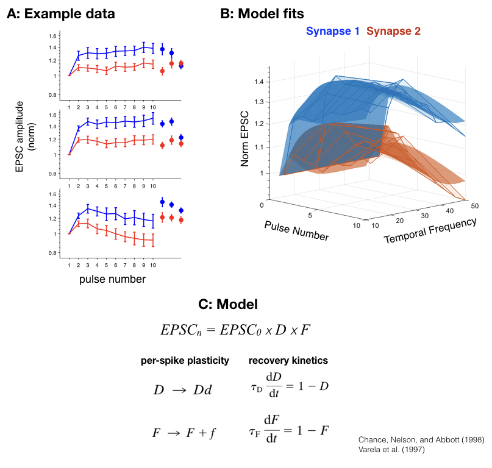

# dynamic-synapses

Neurons in the brain communicate with chemical synapses. Activating a synapse can change the strength that the synapse will have on subsequent activations. These temporal dynamics are known as synaptic plasticity. When the synapse recovers from plasticity quickly (a few hundred milliseconds) we call this "short-term synaptic plasticity". Because the plasticity of a synapse is history dependent, this can create challenges in fitting a statistical model to empirical data.

The code in this repository uses global solvers to fit parameters to a model of short-term synaptic plasticity. Full details of this model can be found in the manuscript by [Varela et al., (1997)](https://www.ncbi.nlm.nih.gov/pubmed/9315911). Briefly, the model assumes:
1. per-spike changes in synaptic strength
1. recovery from plasticity that follows first order kinetics
1. The existence of one or more "depressive" and/or "facilitating" terms that impose increases or decreases in synaptic strength

Since these models can be quite complex, this code uses the `MultiStart` solver in Matlab's `Global Optimization Toolbox` to identify the best fitting parameters.

</br>
<figurecaption>
__Figure 1:__ This code takes in raw electrophysiology data and fits a model of short term synaptic plasticity.</br>
__A:__ Example raw data. Each point represents the synaptic strength in response to a sequence of 13 activations. Synaptic strength is normalized to that of the first activation. The three pannels correspond to different rates of activation (12Hz, 25Hz, and 50Hz respectively). Each color represents a different synapse.</br>
__B:__ The raw data from __A__ are replotted in 3D (wire frame) and the best fitting model is superimposed (smooth surfaces). Notices that the smooth surfaces of the model do a good job describing the raw data.</br>
__C__: Outline of the model.
</figurecaption></br></br>


## Usage

#### Run the fitting routine

The main function that fits parameters to the data is shown here:

```matlab
[fit_params, fval] = fit_vca_model(raw, spike_times, model)
```
Where `raw` is a cell array that contains the raw data (amplitudes of synaptic inputs) and `spike_times` is a cell array with the same dimensions as `raw` that contains the times of each synaptic activation.

`model` should be supplied as a vector and specifies how many "depressive" and "facilitating" terms will be included in the model. For example `['DDFF']` will create a model with 2 depressive and 2 facilitating terms.

`fit_params` will be a vector of the best fitting parameters. There will be twice as many parameters as there are plasticity terms. So, when `model = ['DDFF']` there will be 8 parameters. For each plasticity term there is 1 parameter for per-spike plasticity, and 1 parameter for the time constant of recovery.

#### Extract the best fitting parameters

To convert the vector `fit_params` into the corresponding plasticity and time constant parameters use this utility function:

```matlab
[d, tau_d, f, tau_f] = parse_vca_model_coeffs(params, model);
```

#### Generate model predictions

To generate predictions of the model, use the following command:

```matlab
predicted = predict_vca_psc(spike_times, d, tau_d, f, tau_f, A0)
```
Here, `spike_times` must be a vector of times that the synapse is activated. Note: these times can be different than those used to train the model, and allow the model to be used on arbitrary temporal statistics.


##### License

Copyright (C) 2017 Charlie Hass

This program is free software: you can redistribute it and/or modify
it under the terms of the GNU General Public License as published by
the Free Software Foundation, either version 3 of the License, or
(at your option) any later version.

This program is distributed in the hope that it will be useful,
but WITHOUT ANY WARRANTY; without even the implied warranty of
MERCHANTABILITY or FITNESS FOR A PARTICULAR PURPOSE.  See the
GNU General Public License for more details.

You should have received a copy of the GNU General Public License
along with this program.  If not, see <http://www.gnu.org/licenses/>.
